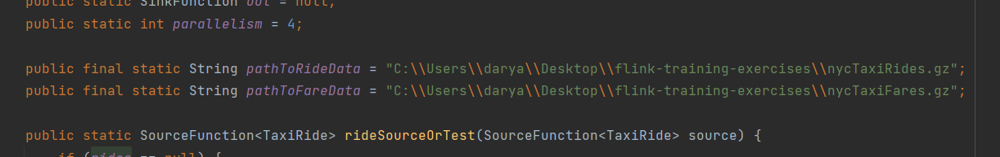
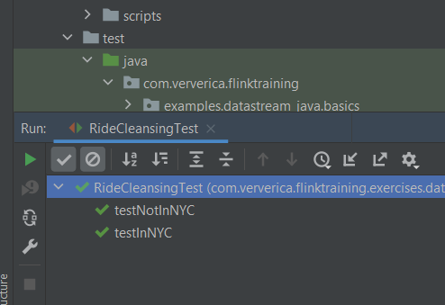
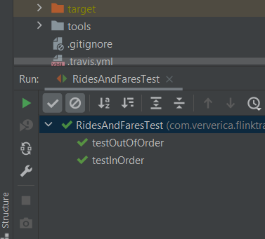
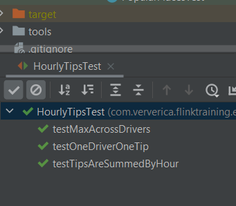
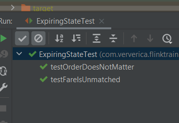

Указание пути к данным в переменных pathToRideData и pathToFareData в файле ExerciseBase.java.

Результаты тестов для [RideCleanisingExercise](tasks/RideCleansingExercise.java)

Результаты тестов для [RidesAndFaresExercise](tasks/RidesAndFaresExercise.java)

Результаты тестов для [HourlyTipsExerxise](tasks/HourlyTipsExercise.java)

Результаты тестов для [ExpiringStateExercise](tasks/ExpiringStateExercise.java)

